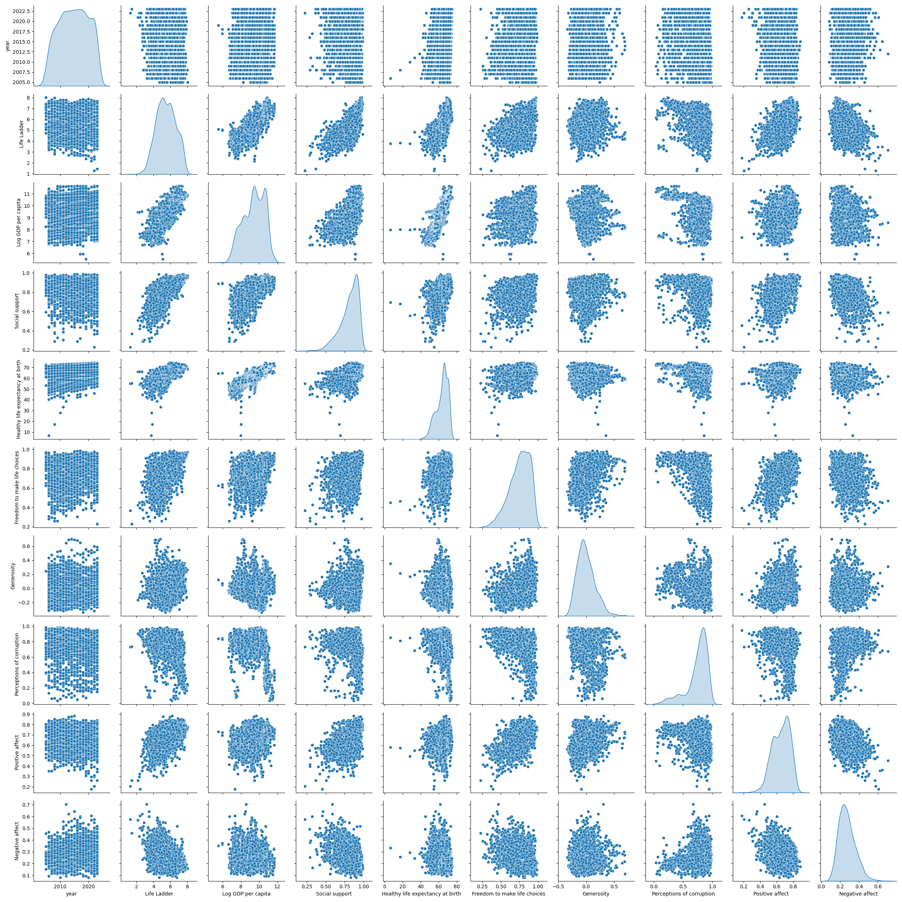

# Data Analysis Report
Analysis performed on 2024-12-12 20:09:11

## General Statistics
Dataset Summary:
Shape: 2363 rows, 11 columns
Columns: Country name, year, Life Ladder, Log GDP per capita, Social support, Healthy life expectancy at birth, Freedom to make life choices, Generosity, Perceptions of corruption, Positive affect, Negative affect
Total no of NaN values in the dataset:386
Unique values in categorical columns:
Country name    165
dtype: int64
Top five values in Country name:
{'Lebanon': 18, 'Jordan': 18, 'Nicaragua': 18, 'Nepal': 18, 'Moldova': 18}

Summary Statistics:
              year  Life Ladder  Log GDP per capita  ...  Perceptions of corruption  Positive affect  Negative affect
count  2363.000000  2363.000000         2335.000000  ...                2238.000000      2339.000000      2347.000000
mean   2014.763860     5.483566            9.399671  ...                   0.743971         0.651882         0.273151
std       5.059436     1.125522            1.152069  ...                   0.184865         0.106240         0.087131
min    2005.000000     1.281000            5.527000  ...                   0.035000         0.179000         0.083000
25%    2011.000000     4.647000            8.506500  ...                   0.687000         0.572000         0.209000
50%    2015.000000     5.449000            9.503000  ...                   0.798500         0.663000         0.262000
75%    2019.000000     6.323500           10.392500  ...                   0.867750         0.737000         0.326000
max    2023.000000     8.019000           11.676000  ...                   0.983000         0.884000         0.705000

[8 rows x 10 columns]
Number of outliers in each column:
{'year': 0, 'Life Ladder': 2, 'Log GDP per capita': 3, 'Social support': 23, 'Healthy life expectancy at birth': 14, 'Freedom to make life choices': 10, 'Generosity': 21, 'Perceptions of corruption': 34, 'Positive affect': 10, 'Negative affect': 18}
- Correlation between year and Life Ladder: 0.04684610051501426
- Correlation between year and Log GDP per capita: 0.0801038042092143
- Correlation between year and Social support: -0.04307366249007443
- Correlation between year and Healthy life expectancy at birth: 0.1680261668344358
- Correlation between year and Freedom to make life choices: 0.23297364128770673
- Correlation between year and Generosity: 0.030864447848132345
- Correlation between year and Perceptions of corruption: -0.08213550694924404
- Correlation between year and Positive affect: 0.013052478449075582
- Correlation between year and Negative affect: 0.20764226977856476
- Correlation between Life Ladder and year: 0.04684610051501426
- Correlation between Life Ladder and Log GDP per capita: 0.7835562687553225
- Correlation between Life Ladder and Social support: 0.7227383546061085
- Correlation between Life Ladder and Healthy life expectancy at birth: 0.7149267857617218
- Correlation between Life Ladder and Freedom to make life choices: 0.5382097259777252
- Correlation between Life Ladder and Generosity: 0.1773984122978712
- Correlation between Life Ladder and Perceptions of corruption: -0.43048504537012455
- Correlation between Life Ladder and Positive affect: 0.5152831989958628
- Correlation between Life Ladder and Negative affect: -0.35241201248320425
- Correlation between Log GDP per capita and year: 0.0801038042092143
- Correlation between Log GDP per capita and Life Ladder: 0.7835562687553226
- Correlation between Log GDP per capita and Social support: 0.6853285024924181
- Correlation between Log GDP per capita and Healthy life expectancy at birth: 0.8193259264445782
- Correlation between Log GDP per capita and Freedom to make life choices: 0.3648160453309555
- Correlation between Log GDP per capita and Generosity: -0.0007659847139493402
- Correlation between Log GDP per capita and Perceptions of corruption: -0.35389255821352356
- Correlation between Log GDP per capita and Positive affect: 0.2308681589786359
- Correlation between Log GDP per capita and Negative affect: -0.2606891913521728
- Correlation between Social support and year: -0.04307366249007443
- Correlation between Social support and Life Ladder: 0.7227383546061085
- Correlation between Social support and Log GDP per capita: 0.6853285024924181
- Correlation between Social support and Healthy life expectancy at birth: 0.5977870467057784
- Correlation between Social support and Freedom to make life choices: 0.40413086354010863
- Correlation between Social support and Generosity: 0.06523987499766269
- Correlation between Social support and Perceptions of corruption: -0.22140950297465503
- Correlation between Social support and Positive affect: 0.42452443789791877
- Correlation between Social support and Negative affect: -0.4548776400906279
- Correlation between Healthy life expectancy at birth and year: 0.16802616683443578
- Correlation between Healthy life expectancy at birth and Life Ladder: 0.7149267857617218
- Correlation between Healthy life expectancy at birth and Log GDP per capita: 0.8193259264445782
- Correlation between Healthy life expectancy at birth and Social support: 0.5977870467057785
- Correlation between Healthy life expectancy at birth and Freedom to make life choices: 0.3757451394722483
- Correlation between Healthy life expectancy at birth and Generosity: 0.015168207483190803
- Correlation between Healthy life expectancy at birth and Perceptions of corruption: -0.303129985574044
- Correlation between Healthy life expectancy at birth and Positive affect: 0.21798223187372143
- Correlation between Healthy life expectancy at birth and Negative affect: -0.1503295419444118
- Correlation between Freedom to make life choices and year: 0.23297364128770676
- Correlation between Freedom to make life choices and Life Ladder: 0.5382097259777252
- Correlation between Freedom to make life choices and Log GDP per capita: 0.3648160453309555
- Correlation between Freedom to make life choices and Social support: 0.4041308635401086
- Correlation between Freedom to make life choices and Healthy life expectancy at birth: 0.3757451394722483
- Correlation between Freedom to make life choices and Generosity: 0.3213958516249051
- Correlation between Freedom to make life choices and Perceptions of corruption: -0.46602264599269855
- Correlation between Freedom to make life choices and Positive affect: 0.578398160014822
- Correlation between Freedom to make life choices and Negative affect: -0.27895931560861287
- Correlation between Generosity and year: 0.030864447848132345
- Correlation between Generosity and Life Ladder: 0.17739841229787118
- Correlation between Generosity and Log GDP per capita: -0.0007659847139493403
- Correlation between Generosity and Social support: 0.06523987499766269
- Correlation between Generosity and Healthy life expectancy at birth: 0.015168207483190801
- Correlation between Generosity and Freedom to make life choices: 0.3213958516249051
- Correlation between Generosity and Perceptions of corruption: -0.2700039823813804
- Correlation between Generosity and Positive affect: 0.3006076315281512
- Correlation between Generosity and Negative affect: -0.07197460755980191
- Correlation between Perceptions of corruption and year: -0.08213550694924404
- Correlation between Perceptions of corruption and Life Ladder: -0.4304850453701245
- Correlation between Perceptions of corruption and Log GDP per capita: -0.35389255821352356
- Correlation between Perceptions of corruption and Social support: -0.22140950297465506
- Correlation between Perceptions of corruption and Healthy life expectancy at birth: -0.303129985574044
- Correlation between Perceptions of corruption and Freedom to make life choices: -0.4660226459926985
- Correlation between Perceptions of corruption and Generosity: -0.2700039823813804
- Correlation between Perceptions of corruption and Positive affect: -0.2742083415576299
- Correlation between Perceptions of corruption and Negative affect: 0.26555543325128544
- Correlation between Positive affect and year: 0.013052478449075583
- Correlation between Positive affect and Life Ladder: 0.5152831989958628
- Correlation between Positive affect and Log GDP per capita: 0.2308681589786359
- Correlation between Positive affect and Social support: 0.42452443789791877
- Correlation between Positive affect and Healthy life expectancy at birth: 0.21798223187372143
- Correlation between Positive affect and Freedom to make life choices: 0.578398160014822
- Correlation between Positive affect and Generosity: 0.3006076315281512
- Correlation between Positive affect and Perceptions of corruption: -0.2742083415576299
- Correlation between Positive affect and Negative affect: -0.3344511128695892
- Correlation between Negative affect and year: 0.20764226977856473
- Correlation between Negative affect and Life Ladder: -0.35241201248320425
- Correlation between Negative affect and Log GDP per capita: -0.2606891913521728
- Correlation between Negative affect and Social support: -0.454877640090628
- Correlation between Negative affect and Healthy life expectancy at birth: -0.15032954194441184
- Correlation between Negative affect and Freedom to make life choices: -0.2789593156086128
- Correlation between Negative affect and Generosity: -0.07197460755980191
- Correlation between Negative affect and Perceptions of corruption: 0.26555543325128544
- Correlation between Negative affect and Positive affect: -0.3344511128695892

## Visualizations

## Story

In a recent analysis, we examined the sales performance of a retail company over the past year, uncovering several key insights. The dataset included sales figures from various product categories, customer demographics, and marketing campaign effectiveness.

1. **Yearly Sales Performance Overview**
   The company experienced a year-on-year growth of 15%, with total sales reaching an impressive $5 million. This growth was particularly notable during the holiday season, where sales surged by 40% compared to the previous year. 

2. **Product Category Insights**
   A detailed breakdown of sales by product category highlighted that electronics accounted for the highest revenue, making up 45% of total sales. However, the apparel category showed the most significant growth rate of 25%, suggesting a shift in customer preferences.

3. **Customer Demographics**
   Analysis of customer demographics revealed that millennials (aged 25-40) represented 60% of the customer base, indicating a shift in purchasing power. This demographic also spent 30% more on average compared to other age groups, particularly in the lifestyle and wellness segments.

4. **Marketing Campaign Effectiveness**
   The effectiveness of marketing campaigns was assessed through a combination of website traffic and conversion rates. Campaigns targeting social media users yielded the highest return on investment (ROI), creating a 5:1 ratio compared to email marketing initiatives. 

5. **Strategic Recommendations**
   To capitalize on these insights, it is recommended that the company increases its investment in digital marketing strategies, particularly on social media platforms to engage with the millennial audience. Additionally, expanding the apparel line could meet growing consumer interest and drive further sales growth.