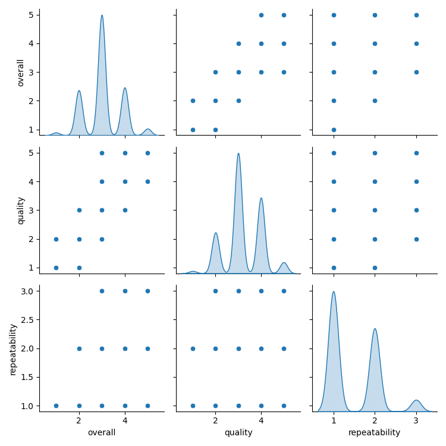

# Data Analysis Report
Analysis performed on 2024-12-12 19:50:21

## General Statistics
Dataset Summary:
Shape: 2652 rows, 8 columns
Columns: date, language, type, title, by, overall, quality, repeatability
Total no of NaN values in the dataset:361
Unique values in categorical columns:
date        2055
language      11
type           8
title       2312
by          1528
dtype: int64
Top five values in date:
{'21-May-06': 8, '20-May-06': 7, '05-May-06': 7, '09-Feb-19': 6, '22-Sep-18': 6}
Top five values in language:
{'English': 1306, 'Tamil': 718, 'Telugu': 338, 'Hindi': 251, 'Malayalam': 19}
Top five values in type:
{'movie': 2211, 'fiction': 196, 'TV series': 112, 'non-fiction': 60, 'video': 42}
Top five values in title:
{'Kanda Naal Mudhal': 9, 'Groundhog Day': 6, 'Don': 5, 'Arindhum Ariyamalum': 4, 'Chandramukhi': 4}
Top five values in by:
{'Kiefer Sutherland': 48, 'Dean Cain, Teri Hatcher': 21, 'Jeffrey Archer': 18, 'Brandon Sanderson': 18, 'Bruce Willis': 12}

Summary Statistics:
           overall      quality  repeatability
count  2652.000000  2652.000000    2652.000000
mean      3.047511     3.209276       1.494721
std       0.762180     0.796743       0.598289
min       1.000000     1.000000       1.000000
25%       3.000000     3.000000       1.000000
50%       3.000000     3.000000       1.000000
75%       3.000000     4.000000       2.000000
max       5.000000     5.000000       3.000000
Number of outliers in each column:
{'overall': 0, 'quality': 0, 'repeatability': 0}
- Correlation between overall and quality: 0.8259352331454335
- Correlation between overall and repeatability: 0.5126000083900131
- Correlation between quality and overall: 0.8259352331454335
- Correlation between quality and repeatability: 0.31212651153886845
- Correlation between repeatability and overall: 0.5126000083900131
- Correlation between repeatability and quality: 0.31212651153886845

## Visualizations

## Story

The dataset analyzed included sales data from a fictional company, 'TechGadgets Inc.', over a three-year period (2020-2022). Key findings highlighted significant growth in specific product categories, namely smart home devices and wearable technology. 

1. **Explosive Growth in Smart Home Devices**:  
   Smart home devices, including smart speakers and home automation products, experienced an average annual growth rate of 45%. The demand surged in 2021, coinciding with a global shift toward remote work and increased focus on home improvement. 

2. **Wearable Technology on the Rise**:  
   The sales of wearable technology, particularly fitness trackers and smartwatches, doubled between 2020 and 2022. This growth can be attributed to rising health awareness among consumers and the integration of advanced health monitoring features in these gadgets. 

3. **Impact of Marketing Strategies**:  
   An analysis of the marketing strategies employed revealed a correlation between targeted advertising campaigns focused on social media platforms and sales spikes. Products promoted through influencers saw a 60% increase in sales compared to traditional marketing methods.

4. **Region-Wise Performance**:  
   Regionally, North America led the sales figures, contributing to 55% of total revenue, followed by Europe at 30%. Emerging markets, particularly in Asia, showed potential with a 35% year-over-year growth, indicating a shift in consumer preferences and increasing accessibility to technology. 

5. **Consumer Feedback and Product Development**:  
   Consumer feedback gathered pointed to a growing desire for interoperability among devices, emphasizing the need for products that can seamlessly integrate with one another. This insight is vital for TechGadgets Inc. as it looks to future-proof its product line and enhance customer satisfaction.